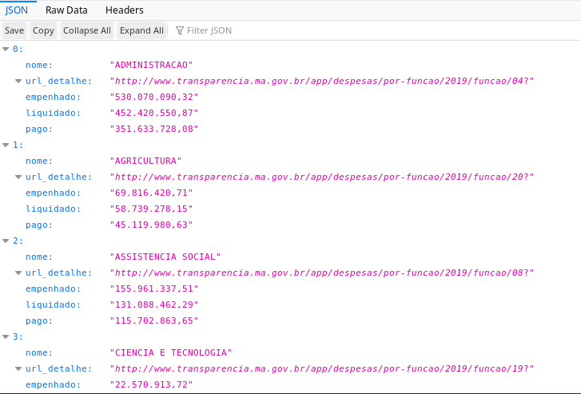
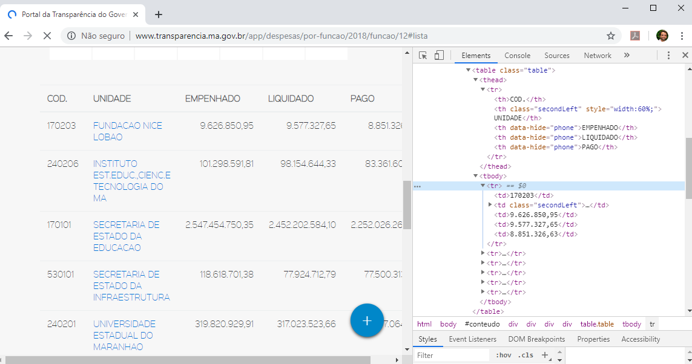
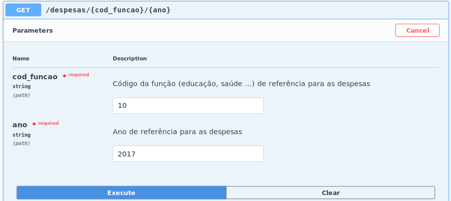
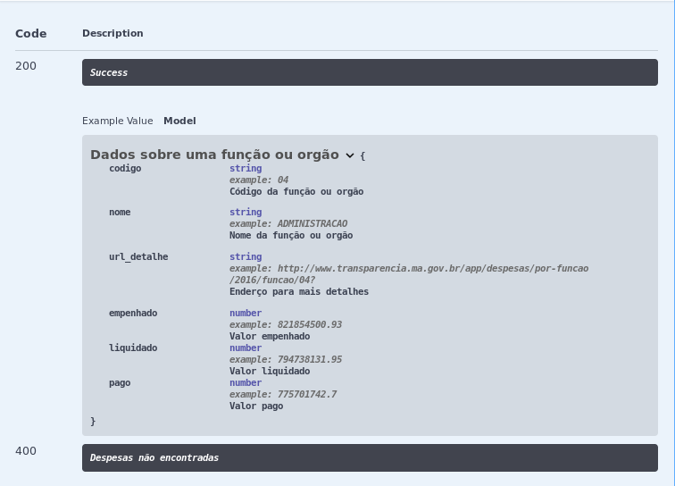
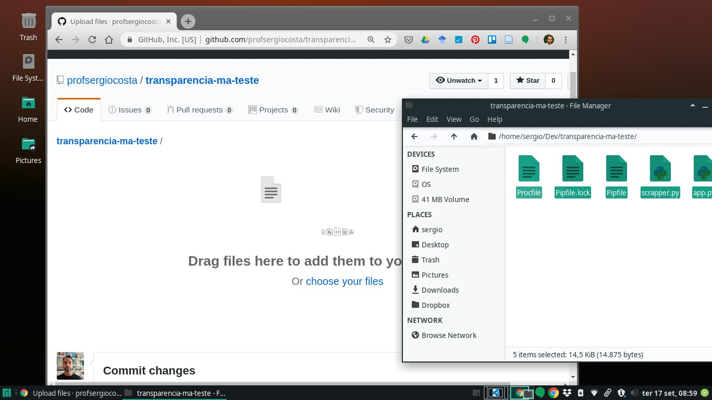
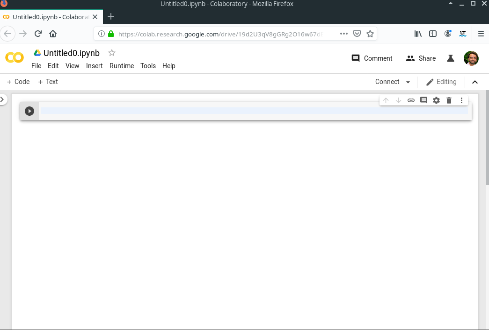
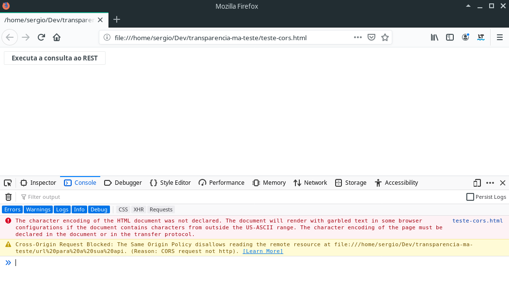
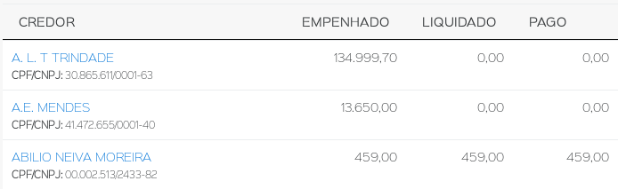

## Os cinco passos para transformar qualquer site de dados públicos em uma API de dados abertos

* Sérgio Souza Costa
* Mateus Vitor Duarte Sousa
* Micael Lopes da Silva

---
## Roteiro

1. Introdução
2. Passo 1: Identificação e modelagem dos dados


---

## Introdução


---


## Passo 1: Identificação e modelagem dos dados

- Identificar sites com dados de interesse da sociedade e que ainda não possuem APIs
- Muitos sites de instituições públicas ainda não migraram para dados abertos.
- Um exemplo é o site da transparência do governo do Estado do Maranhão http://www.transparencia.ma.gov.br.
    - Ele foi lançado em 2015 e apresenta diversas melhorias em relação ao anterior, mas ainda não disponibiliza dados abertos através de uma API. 
    - O acesso a todos os dados requer a interação entre um usuário e um navegador web.
    - Mesmo para baixar os dados, é necessário a interação com um usuário.

---

## Passo 1: Identificação e modelagem dos dados
Por exemplo, ao acessar o seguinte endereço 
* http://www.transparencia.ma.gov.br/app/despesas/por-funcao/2019#lista 

Tem se a seguinte tabela que descreve as despesas de cada função administrativa em 2019.


* Nesse site, já temos os dados bem estruturados, o que é preciso estraí-los e criar o acesso através de uma API.

Vamos para o PASSO 2 ?


---


## Passo 2: Extração dos dados

* Existem hoje diversas bibliotecas nas mais distintas linguagens capazes de executar o "web scrapping". 

* Nesse minicurso, usaremos o Python e a biblioteca beautifulsoup4.

* Vamos configurar o ambiente ?


---
## Passo 2: Extração dos dados (instalando o pipenv)

* Antes de mais nada, iremos usar o pipenv, então vamos lopo instalar.

* Abra um terminal e instale o pipenv com o seguinte comando

        $ pip install pipenv

---
## Passo 2: Extração dos dados (criando o projeto e instalando as depedências)

- Para criar o projeto, crie uma pasta chamada transparencia-ma, e nela execute o seguinte comando:

        $ pipenv --three

- Instalando as depedências básicas:

      $ pipenv install requests beautifulsoup4 lxml
    
---
## Passo 2: Extração dos dados (testando a configuração inicial)

- Antes de prosseguir, vamos ver se está tudo ok com as instalações.

- Crie um arquivo chamado `scrapper.py` com o seguinte código:

```python
import requests
from bs4 import BeautifulSoup as BS

url = "http://www.transparencia.ma.gov.br/app/despesas/por-funcao/2019#lista"
page_response = requests.get(url)
page = BS(page_response.text, 'lxml')
table = page.find ('table')
print (table)
```

- No terminal, inicialize o ambiente `pipenv` e então execute o arquivo `scrapper.py`

        $ pipenv shell
        $ python scrapper.py 
    
- Ao executar o comando acima, será impresso um codigo HTML da tabela selecionada.

```html
<tr>
<td>19</td>
<td class="secondLeft">
<a href="http://www.transparencia.ma.gov.br/app/despesas/por-funcao/2019/funcao/19?">
            CIENCIA E TECNOLOGIA
            </a>
</td>
<td>22.570.913,72</td>
<td>17.746.719,47</td>
<td>13.433.197,71</td>
</tr>
```

> CheckPoint: Conseguiu executar o comando acima ? Imprimiu o HTML ? Ok, podemos seguir:

---


substitua o codigo do arquivo scapper.py pelo seguinte código:

ERRATA, apenas 3 registros

```python
import requests
from bs4 import BeautifulSoup as BS

def despesas_total ():
    url = "http://www.transparencia.ma.gov.br/app/despesas/por-funcao/2019#lista"
    response = requests.get(url)
    page = BS(response.text, 'lxml')
    table = page.find ('table')
    rows = table.find_all('tr')
    despesas = []
    for row in rows[1:]: 
        cols =row.find_all("td")
        despesa = {}
        despesa["nome"] = cols[1].find("a").get_text().strip()
        despesa["url_detalhe"] = cols[1].find("a").get('href')
        despesa["empenhado"] = cols[2].get_text().strip()
        despesa["liquidado"] = cols[3].get_text().strip()
        despesa["pago"] = cols[4].get_text().strip()
        despesas.append(despesa)

    return despesas

# remover o codigo abaixo
print (despesas_total())
```

Execute o codigo novamente:

```
 $ python scrapper.py 
[{'nome': 'ADMINISTRACAO', 'url_detalhe': 'http://www.transparencia.ma.gov.br/app/despesas/por-funcao/2019/funcao/04?', 'empenhado': '530.070.090,32', 'liquidado': '452.420.550,87', 'pago': '351.633.728,08'}, {'nome': 'AGRICULTURA', 'url_detalhe': 'http://www.transparencia.ma.gov.br/app/despesas/por-funcao/2019/funcao/20?', 'empenhado': '69.816.420,71', 'liquidado': '58.739.278,15', 'pago': '45.119.980,63'}, ...]
```

Apos este teste, remova a seguinte linha:

    print (despesas_total())

Finalizado a extração

---

## Desenvolvimento da API

Primeiro instale o framework

    $ pipenv install flask-restplus
    
Escrevendo uma API bem simples, crie um arquivo app.py com o seguinte código:

```python
from flask import Flask
from flask_restplus import Resource, Api, fields
from scrapper import despesas_total

app = Flask(__name__)
api = Api(app)

@api.route('/despesas')
class Despesas(Resource):
    def get(self):
        return despesas_total()

if __name__ == '__main__':
    app.run(debug=True)
```

Para testar o servidor:

```
$ python app.py
 * Serving Flask app "app" (lazy loading)
 * Environment: production
   WARNING: This is a development server. Do not use it in a production deployment.
   Use a production WSGI server instead.
 * Debug mode: on
 * Restarting with stat
 * Debugger is active!
 * Debugger PIN: 230-864-203
 * Running on http://127.0.0.1:5000/ (Press CTRL+C to quit)
```

Testando no navegador:



---
Especificando o ano

Atualizar a funcao despesa_total:

```python
def despesas_total (ano):
    url_base = "http://www.transparencia.ma.gov.br/app"
    url = url_base + "/despesas/por-funcao/"+ano
    response = requests.get(url)
    page = BS(response.text, 'lxml')
    table = page.find ('table')
    rows = table.find_all('tr')
    despesas = []
    for row in rows[1:]: # testando apenas com 3 linhas
        cols =row.find_all("td")
        despesa = {}
        despesa["nome"] = cols[1].find("a").get_text().strip()
        despesa["url_detalhe"] = cols[1].find("a").get('href')
        despesa["empenhado"] = cols[2].get_text().strip()
        despesa["liquidado"] = cols[3].get_text().strip()
        despesa["pago"] = cols[4].get_text().strip()
        despesas.append(despesa)

    return despesas
```

Alterar o codigo do servidor:

```python
app = Flask(__name__)
api = Api(app)

@api.route('/despesas/<string:ano>')
class Despesas(Resource):
    def get(self, ano):
        return despesas_total(ano)

if __name__ == '__main__':
    app.run(debug=True)
```

---

Testando novamente:

Com essas alterações é possível acessar os dados através de uma rota que inclui o ano de referência para os dados. Por exemplo, os dados do ano de 2016 poderão ser acessados através da seguinte URL: \url{http://localhost:5000/despesas/2016}. 


---
## Despesas por função

O site da transparência do Governo do Maranhão permite  visualizar os detalhes das despesas de uma dada função ou órgão administrativo. Por exemplo, o código da função administrativa \textbf{educação} é 12. Então, a \url{http://www.transparencia.ma.gov.br/app/despesas/por-funcao/2018/funcao/12} detalha como a despesa com a educação foi distribuída para cada orgão.



Então, pode-se adaptar o código do arquivo \texttt{scrapper.py} incluindo uma função que irá extrair o total das despesas e outra detalhada por função administrativa, Código

modificar o codigo scraper.py

```python
import requests
from bs4 import BeautifulSoup as BS
def despesas_total (ano):
    url_base = "http://www.transparencia.ma.gov.br/app"
    url = url_base + "/despesas/por-funcao/"+ano
    return extrai_despesas (url)
    
def despesas_por_funcao (cod, ano):
    url_base = "http://www.transparencia.ma.gov.br/app"
    url = url_base + "/despesas/por-funcao/"+ano+"/funcao/"+cod
    return extrai_despesas (url)

def extrai_despesas (url):
    response = requests.get(url)
    page = BS(response.text, 'lxml')
    table = page.find ('table')
    rows = table.find_all('tr')
    despesas = []
    for row in rows[1:]:
        cols =row.find_all("td")
        despesa = {}
        despesa["codigo"]  = cols[0].get_text().strip()
        despesa["nome"] = cols[1].find("a").get_text().strip()
        despesa["url_detalhe"] = cols[1].find("a").get('href')
        despesa["empenhado"] = cols[2].get_text().strip()
        despesa["liquidado"] = cols[3].get_text().strip()
        despesa["pago"] = cols[4].get_text().strip()
        despesas.append(despesa)
    return despesas
   
```
---
## Adicionando a nova rota


no arquivo app.py

    from scrapper import despesas_total , despesas_por_funcao

ERRATA


```python
@api.route('/despesas/<string:cod_funcao>/<string:ano>')
class DespesasPorFuncao(Resource):
    def get(self, cod_funcao, ano):
        return despesas_por_funcao(cod_funcao, ano)
```
Visualizando nova rota

    curl -X GET "http://localhost:5000/despesas/12/2018" -H "accept:application/json"

ou via browser


---
## Documentação

Uma parte importante em qualquer API é uma boa documentação. Então, no quarto passo será utilizado a biblioteca Swagger\footnote{Site oficial https://swagger.io/} para a construção automatizada de documentação. A biblioteca \texttt{flask-restplus} vem com o suporte para o Swagger e já cria uma documentação básica ao acessar o endereço raiz da API.


Porém, através de uma coleção de \textit{decorators} e parâmetros é possível adicionar novas informações ao código, gerando uma documentação mais detalhada como no Código \ref{lst:swagger_1}.

```python
from flask import Flask
from flask_restplus import Resource, Api, fields
from scrapper import despesas_total, despesas_por_funcao

app = Flask(__name__)
api = Api(app = app, 
		  version = "1.0", 
		  title = "Transparência Maranhão", 
          description = "Uma API não oficial com os dados sobre as receitas e despesas do Governo do Maranhão")
          
ns = api.namespace('despesas', description='Dados de despesas')

@ns.route('/<string:ano>')
class Despesas(Resource):
    def get(self, ano):
        return despesas_total(ano)
@ns.route('/<string:cod_funcao>/<string:ano>')
class DespesasPorFuncao(Resource):
    def get(self, cod_funcao, ano):
        return despesas_por_funcao(cod_funcao, ano)

if __name__ == '__main__':
    app.run(debug=True)
```

As linhas 7, 8 e 9 adicionaram a versão, o nome e a descrição como informações principais da API. Além disso, uma API pode ter diferentes rotas, por exemplo, poderia ter rotas especificas para despesas e outras para receitas. Essas rotas poderiam estar agrupadas por dois diferentes \textit{namespaces}. Aqui foi então criado na linha 11, um \textit{namespace} para as despesas, incluindo sua descrição, e as linhas 13 e 17 foram adaptadas para usá-lo. O resultado da documentação pode ser observado na Figura \ref{fig:swagger_2}.


  
Além das informações para a API e \textit{namespace}, é possível adicionar informações diretamente aos métodos e parâmetros, como apresentado no Código \ref{lst:swagger_2}.



## Metadados

Por fim, pode-se criar os metadados dos dados providos pela API, que incluem os tipos e as descrições dos dados. Os tipos de dados para os valores liquidados, pagos e empenhados são números, no entanto, os dados extraídos estão no formato de texto e usando a representação brasileira. Então, a conversão para número deverá considerar essa representação. Existe uma biblioteca denominada \textit{babel} que possui já implementada essa funcionalidade e pode ser instalada com o seguinte comando:

    $ pipenv install babel

Com a biblioteca \textit{babel} instalada, será necessário algumas atualização no arquivo \texttt{scrapper.py}. Primeiro será necessário importar a função \texttt{parse\_decimal}.


    from babel.numbers import parse_decimal
 
 Atualizar a função extrai despesas
 
 ```python
   def extrai_despesas (url):
    response = requests.get(url)
    page = BS(response.text, 'lxml')
    table = page.find ('table')
    rows = table.find_all('tr')
    despesas = []
    for row in rows[1:]:
        cols =row.find_all("td")
        despesa = {}
        despesa["codigo"]  = cols[0].get_text().strip()
        despesa["nome"] = cols[1].find("a").get_text().strip()
        despesa["url_detalhe"] = cols[1].find("a").get('href')
        despesa["empenhado"] =   parse_decimal (cols[2].get_text().strip(), locale='pt_BR')
        despesa["liquidado"] =  parse_decimal (cols[3].get_text().strip(), locale='pt_BR')
        despesa["pago"] =  parse_decimal (cols[4].get_text().strip(), locale='pt_BR')
        despesas.append(despesa)

    return despesas
```


Modelo

```python
model = api.model('Dados sobre uma função ou orgão', {
    'codigo': fields.String(description='Código da função ou orgão', example="04"),
    'nome': fields.String(description='Nome da função ou orgão', example="ADMINISTRACAO"),
    'url_detalhe': fields.String(description='Endereço para mais detalhes', example="http://www.transparencia.ma.gov.br/app/despesas/por-funcao/2016/funcao/04?"),
    'empenhado': fields.Float(description='Valor empenhado', example=821854500.93),
    'liquidado': fields.Float(description='Valor liquidado', example=794738131.95),
    'pago': fields.Float(description='Valor pago', example=775701742.7),
})
```

Para associar o metadado aos dados retornados, será usado o \textit{decorator}\\ \texttt{@api.marshal\_with} em ambas rotas:

```python
@ns.route('/<string:ano>')
class Despesas(Resource):
    @api.marshal_with(model, mask='*')
    @api.doc ...
```

Para associar o metadado aos dados retornados, será usado o \textit{decorator}\\ \texttt{@api.marshal\_with} em ambas rotas:


```python
@ns.route('/<string:ano>')
class Despesas(Resource):

    @api.marshal_with(model, mask='*')
    @api.doc(responses={ 200: 'OK', 400: 'Despesas não encontradas' }, 
			 params={ 'ano': 'Ano de referência para as despesas' })
    def get(self, ano):
        return despesas_total(ano)


@ns.route('/<string:cod_funcao>/<string:ano>')
class DespesasPorFuncao(Resource):

    @api.marshal_with(model, mask='*')
    @api.doc(responses={ 200: 'OK', 400: 'Despesas não encontradas' }, 
    params={ 'ano': 'Ano de referência para as despesas',
    'cod_funcao' : 'Código da função (educação, saúde ...) de referência para as despesas'})
    def get(self, cod_funcao, ano):
        return despesas_por_funcao(cod_funcao, ano)
```



----
## Implantação

O quinto e último passo tem como objetivo implantar a API desenvolvida. Aqui será usada a plataforma Heroku\footnote{Site oficial: \url{https://www.heroku.com/}}. Então, antes de prosseguir será necessário criar uma conta gratuita nesse portal. Para a implantação será usado também o gerenciador de configuração Git e o repositório Github (\url{http://github.com/}.
 
 Antes de mais nada, vamos instalar o \textit{gunicorn} (\url{https://gunicorn.org/}), um servidor WSGI (Web Server Gateway Interface) necessário para executar os \textit{scripts} Python do lado do servidor. De modo similar as instalações anteriores, basta executar o seguinte comando:
 

    $ pipenv install gunicorn

Depois de instalado, será necessário criar um arquivo denominado Procfile\footnote{Mais informações sobre o Procfile \url{https://devcenter.heroku.com/articles/procfile}} que é utilizado pelo Heroku para a inicialização do serviço. Nesse caos ele indicará o WSGI e o nome do aplicativo. Neste caso o nome do aplicativo é \texttt{app}, e está localizado no módulo (ou arquivo) \texttt{app.py}.

web: gunicorn app:app


Como será usado o repositório \textit{Github}, garanta que já tenha uma conta no \textit{github} e o aplicativo \textit{git} instalado e configurado no computador.  Com isso, será necessário logar na sua conta, criar um repositório denominado \texttt{transparencia-ma} e executar os seguintes comandos porém usando o repositório que foi criado.

\begin{lstlisting}[language=bash, numbers=none]
git init
git add *
git commit -m "first commit"
git remote add origin https://github.com/profsergiocosta/transparencia-ma.git
git push -u origin master
\end{lstlisting}

\begin{callouttip}{Fica a dica}
Nesse exemplo está sendo um repositótio HTTP, então será necessário entrar com o nome do usuário e senha para enviar os dados para o repositório, ou seja, executar o comando \textit{push}. Uma dica é trabalhar com repositório SSH ao invés de HTTP, caso esteja usando esses procedimento em um computador pessoal. 
\end{callouttip}

caso nao tenha o git instalado em seu computador, uma alternativa é fazer o upload dos arquivos diretamente no repositorio:




A Figura \ref{fig:implantacao_heroku} mostra os três passos para implantar uma aplicação no Heroku. O passo 1 cria uma aplicação Heroku com o nome \texttt{transparencia-ma}, o 2 conecta-se a aplicação ao repositório \textit{Github} e o 3 executa a implantação (\textit{deploy}) manual. Na Figura \ref{fig:implantacao_heroku} (4) apenas mostra as mensagens que são impressas durante a implantação. Além do \textit{deploy} manual, é possível marcar implantação (\textit{deploy}) automática, que irá ocorrer a cada novo \textit{commit} ao repositório github.


Depois de implantado, é possível testar

---

## Teste de análise de dados

no colab 

O portal da transparência do Maranhão já disponibiliza diversos dados tabelados. Porém, um usuário pode precisar de um dado que não esteja disponível diretamente. Por exemplo, o usuário poderia querer um gráfico que mostrasse a evolução temporal dos gastos por uma dada função administrativa. Sem uma API, seria necessário entrar em diversas páginas e manualmente anotar os gastos, ou salva-los e manipulá-los através de outro software. Contudo, com a API desenvolvida aqui é possível gerar este gráfico escrevendo um pouco de código em linguagens como Python, R ou JavaScript.

Para exemplificar, foi escrito um código Python diretamente no Google Colab \footnote{ Google Colab pode ser acessado em: \url{https://colab.research.google.com/}}. O código completo da Figura \ref{fig:colab} pode ser acessado em \url{http://bit.ly/304z5XF}.



Entre com o seguinte codigo:

```python
import json, requests
import matplotlib.pyplot as plt

url = "escreva aqui a url do seu aplicativo no heroku"
valores =[]
anos = []
codigo_funcao = "19" # 19 é o código para ciência e tecnologia
for ano in range (2015, 2020):
  r = requests.get(url+str(ano))
  anos.append (ano)
  dados = r.json()
  for dado in dados:
    if dado['codigo'] == codigo_funcao:
      valores.append(dado['empenhado'])
      break
plt.bar (anos,valores)
plt.show()
```

---
## \subsection{Um teste simples de aplicação}

Além de ser usado para análise, os dados abertos podem ser acessados por aplicativos web e móveis. Nesse caso, uma possibilidade seria desenvolver aplicativos híbridos usando a linguagem JavaScript, através de \textit{frameworks} como o Angular, React e Electron.

Como o objetivo é fazer um teste simples, foi escrito um código usando a biblioteca \textit{JQuery} que executa uma requisição e imprime no console o resultado, Código \ref{lst:teste_ajax}. O código completo pode ser acessado em \url{https://repl.it/@SergioSouza1/testeapi}.

crie um arquivo html com o seguinte codigo

```html
<!DOCTYPE html>
<html>
<head>
<script src="https://ajax.googleapis.com/ajax/libs/jquery/3.4.1/jquery.min.js"></script>
<script>
$(document).ready(() =>  
    $("button").click( () =>  $.ajax({
        url: "url para a sua api", 
        success: (result) => console.log (result) })
))
</script>
</head>
<body>
<button>Executa a consulta ao REST</button>
</body>
</html>

```

Abra em um navegador, ative o web console e  click no botão:



----
Antes de executar o teste, modifique a URL para referenciar o serviço que foi criado no Heroku. Porém, esse simples teste irá falhar e apresentar seguinte mensagem no navegador:

\begin{lstlisting}[linenumber=none]
Cross-Origin Request Blocked: The Same Origin Policy disallows reading the remote resource at https://transparencia-ma.herokuapp.com/despesas/10/2018. (Reason: CORS header ‘Access-Control-Allow-Origin’ missing).
\end{lstlisting}

Isso ocorre porque, por padrão, o JavaScript não permite que aplicações de domínios distintos compartilhem recursos. Porém é possível habilitar o que é conhecido como CORS (que em português seria Compartilhamento de Recursos de Origem Cruzada). Então, para tudo funcionar corretamente, será necessário retornar ao ambiente de desenvolvimento da API. 

Primeiro passo será instalar a extensão para dar esse suporte, que é feito pela biblioteca \texttt{flask\_cors}:

\begin{lstlisting}[language=bash, numbers=none]
pipenv install flask_cors
\end{lstlisting}

Depois no arquivo \texttt{app.py}, sera adicionado um novo \textit{import}:
\begin{lstlisting}[language=Python]
from flask_cors import CORS
\end{lstlisting}

E então, será executado a função CORS ao aplicativo:

\begin{lstlisting}[language=Python]
CORS(app)
\end{lstlisting}

O código completo pode ser acessado em: \url{http://bit.ly/2PcfHXZ}. 

Atualizado esse código, deve-se enviar as modificações para o repositório \textit{Github} e, por fim, executar a implantação novamente no Heroku. Com o serviço implantado e atualizado, basta executar o código novamente para ser impresso os dados em JSON no console. Lembrando, que esse é um exemplo extremamente simples, porém a sua execução mostra que a API está pronta para ser usada por aplicações em JavaScript.


---

Evolução

O site do governo do Maranhão possui diversos outros dados que poderão ser extraídos. Por exemplo, ao acessar um dado órgão, pela seguinte \url{http://www.transparencia.ma.gov.br/app/despesas/por-funcao/2019/funcao/12/orgao/240201} é possível ter acesso aos nomes, CPF ou CNPJ dos credores, e também os valores empenhado, liquidado e pago, como na Figura \ref{fig:credores}. \\ \\ \\



\begin{figure}[htb]
    \centering
    \includegraphics[width=.9\columnwidth]{Figuras/tabela_por_unidade.png}
    \caption{Credores de um dado orgão público}
    \label{fig:credores}
\end{figure}


Observa-se que a tabela é muito similar a que foi extraída na Seção \ref{sec:mapeando}, com a diferença que cada credor possui um CPF ou CNPJ em vez de um código. Então o Código \ref{lst:despesas_orgao} será também muito similar ao escrito anteriormente na Seção \ref{sec:mapeando}

\begin{lstlisting}[language=python, firstnumber=30, label={lst:despesas_orgao},caption={Extraindo os dados por orgão público}]

def despesas_por_orgao (orgao, funcao, ano):
    url = "http://www.transparencia.ma.gov.br/app/despesas/por-funcao/"+ano+"/funcao/"+funcao+"/orgao/"+orgao+"?#lista"
    response = requests.get(url)
    page = BS(response.text, 'lxml')
    table = page.find ('table')
    rows = table.find_all('tr')
    despesas = []
    for row in rows[1:]:
        cols =row.find_all("td")
        despesa = {}
        despesa["nome"] = cols[0].find("a").get_text().strip()
        despesa["url_detalhe"] = cols[0].find("a").get('href')
        despesa["cpf/cnpj"] = cols[0].find("small").get_text().strip().replace ("CPF/CNPJ: ","")
        despesa["empenhado"] =  parse_decimal(cols[1].get_text().strip(), locale='pt_BR')
        despesa["liquidado"] =  parse_decimal(cols[2].get_text().strip(), locale='pt_BR')
        despesa["pago"] = parse_decimal (cols[3].get_text().strip(), locale='pt_BR')
        despesas.append(despesa)
    return despesas
\end{lstlisting}

Após criar a função do Código \ref{lst:despesas_orgao}, é possível criar uma nova rota que inclui o código do órgão administrativo, por exemplo: \url{https://transparencia-ma.herokuapp.com/despesas/240206/12/2018}. Então, será necessário atualizar a rota, fazer um novo \textit{commit}, enviar as atualizações e executar um novo \textit{deploy}.

O processo de transformação de dados públicos em dados abertos requer muita exploração do site de dados públicos. Por exemplo, aqui seria possível extrair ainda diversas outras informações como:

\begin{itemize}
    \item Ainda sobre despesas, é possível extrair informações detalhadas por credor. 
    \item Além dos dados de despesas, pode-se extrair os dados de receitas de modo muito similar.
    \item Dados sobre servidores públicos, como salário e diárias.
    \item Transferência de valores, por exemplo, repasse a municípios.
\end{itemize}

Além desses dados é possível evoluir bastante essa API, permitindo extrair cada vez mais informações relevantes.